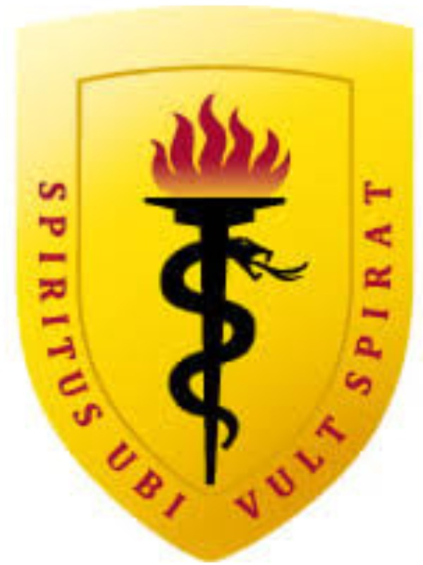
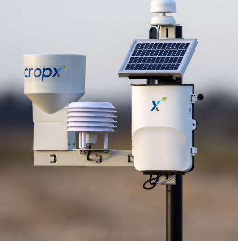
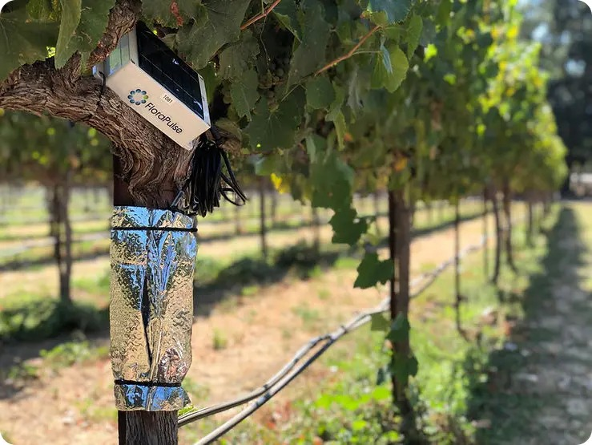
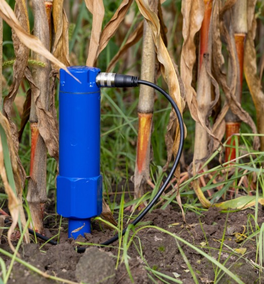

    UNIVERSIDAD PERUANA CAYETANO HEREDIA
      
    Facultad de Ciencias e Ingeniería 
    
      
    FUNDAMENTOS DE DISEÑO
      
    TALLER 03 
    REFERENCIAS BIBLIOGRÁFICAS   
    PROFESORES: 
    Marco Antonio Mugaburu Celi  
    Jose Luiz Da Silva 
    Jhomer Rodrigo Contreras Paucca
      
    PRESENTADO POR: 
    RAMIREZ URIOL RUBEN MOISES ENMANUEL 
    PUMA CUTIPA WILL ALEX 
    CHAVEZ ALIAGA ALDAIR ALEXANDER 
    ALVAREZ HANAMPA YESSICA 
    SÁNCHEZ MORÓN ANGELI DARIANA
      
    2026

***REFERENCIAS BIBLIOGRÁFICAS***

1. ARTÍCULOS CIENTÍFICOS.

**1\. AquaCrop-IoT: plataforma inteligente de riego mediante información del cultivo y condiciones meteorológicas**

Tema

El artículo aborda la programación inteligente del riego mediante la integración del estado real del cultivo, variables meteorológicas y modelos de necesidades hídricas.

El sistema fue evaluado utilizando trigo duro (*Triticum durum*) en Córdoba, España.

A diferencia de sistemas que toman decisiones únicamente a partir de la humedad del suelo, la propuesta incorpora información sobre el desarrollo del cultivo mediante imágenes que permiten estimar la cobertura vegetal o Canopy Cover (CC).

Aporte

El principal aporte del estudio consiste en actualizar dinámicamente el modelo AquaCrop utilizando información real del desarrollo del cultivo.

La arquitectura puede representarse conceptualmente como:

Datos meteorológicos \+ pronóstico \+ características del cultivo \+ imágenes RGB → AquaCrop → necesidad de riego.

Esta integración permitió modificar la cantidad de agua inicialmente estimada por el modelo y obtener aproximadamente una reducción del 32 % en el requerimiento de riego recomendado durante el periodo analizado.

Este antecedente demuestra que incorporar únicamente datos meteorológicos y sensores no representa por sí mismo una innovación suficiente; el comportamiento real del cultivo también puede utilizarse para modificar las decisiones de riego.

Variables, rangos y valores utilizados

El experimento se realizó aproximadamente a 238 m s. n. m. Las condiciones climáticas históricas de la zona presentan temperaturas medias mensuales aproximadamente entre 8.4 °C y 28.1 °C.

La evapotranspiración de referencia (ET₀) presentó valores medios mensuales aproximadamente entre 1.1 y 7.6 mm/día, mientras que la ET₀ anual media reportada fue cercana a 1413 mm/año.

La precipitación media anual de la zona fue aproximadamente de 573 mm/año. Durante el periodo específico considerado en el análisis se registraron aproximadamente 60 mm de precipitación, frente a una ET₀ acumulada cercana a 381 mm.

En cuanto al suelo utilizado en el experimento, se reportó aproximadamente:

* 37.3 % de arcilla  
* 34.4 % de limo  
* 28.3 % de arena  
* pH de 7.65  
* conductividad eléctrica de 0.164 dS/m

También se consideró una profundidad radicular máxima cercana a 0.60 m.

Durante el experimento se realizaron tres aplicaciones de aproximadamente 40 mm de agua cada una, equivalentes a aproximadamente 120 mm de riego total.

La cobertura vegetal no presentó un valor fijo, ya que fue medida progresivamente mediante imágenes RGB conforme avanzaba el desarrollo del cultivo.

Por ello, las principales variables identificadas en este trabajo fueron:

temperatura, precipitación, evapotranspiración, características del suelo, cobertura vegetal, desarrollo del cultivo, condiciones meteorológicas y cantidad de agua aplicada.[(1)](https://www.zotero.org/google-docs/?LOPQhn)

**2\. Sistemas de riego inteligente habilitados por IoT para la gestión precisa del agua**

Tema

El artículo estudia el estado actual de las tecnologías IoT utilizadas para riego de precisión, analizando sensores, tecnologías de comunicación, algoritmos, plataformas y resultados obtenidos en diferentes investigaciones.

A diferencia de los otros dos artículos, este trabajo no analiza un único cultivo ni realiza un solo experimento, sino que consolida información procedente de numerosos estudios.

Aporte

Su principal aporte para el proyecto consiste en identificar qué tecnologías ya han sido desarrolladas y cuáles siguen presentando limitaciones.

La búsqueda inicial identificó aproximadamente 323 publicaciones, de las cuales finalmente fueron seleccionados 50 estudios correspondientes principalmente al periodo 2018-2025.

Los sistemas revisados utilizan frecuentemente:

sensores de humedad del suelo, temperatura, humedad relativa, evapotranspiración, precipitación, estaciones meteorológicas, redes inalámbricas, LoRaWAN, computación en la nube, aprendizaje automático e índices de vegetación.

Los resultados analizados muestran reducciones en el consumo de agua aproximadamente entre 9 % y 50 %, dependiendo del cultivo, tecnología, condiciones ambientales y metodología empleada.

En algunos estudios también se reportaron mejoras o mantenimiento de la productividad agrícola, frecuentemente dentro de rangos aproximados de 5 % a 25 % cuando existieron incrementos de rendimiento.

El artículo resulta especialmente importante para el desarrollo del proyecto porque identifica limitaciones todavía presentes en los sistemas de riego inteligente, entre ellas:

costo de implementación, calibración de sensores, interoperabilidad, escalabilidad, mantenimiento, disponibilidad de conectividad y adopción por pequeños agricultores.

Variables, rangos y valores

Al tratarse de una revisión sistemática, no existe un único rango de temperatura, humedad o evapotranspiración aplicable a todos los estudios.

Los valores dependen de cada cultivo, suelo, país y condición climática.

Por ello, las variables deben registrarse de la siguiente manera:

Humedad del suelo: utilizada ampliamente, pero sin un rango universal.

Temperatura ambiental: utilizada como variable meteorológica, sin rango único.

Humedad relativa: utilizada en distintos sistemas, sin rango universal.

Evapotranspiración: utilizada para estimar demanda hídrica, con valores dependientes de la ubicación y cultivo.

Precipitación: utilizada tanto mediante mediciones como pronósticos meteorológicos, sin rango general.

NDVI y LAI: utilizados en algunos trabajos para caracterizar vegetación y desarrollo del cultivo.

Los valores cuantitativos más importantes encontrados en la revisión fueron:

* 323 publicaciones inicialmente identificadas.  
* 50 investigaciones seleccionadas.  
* Periodo principal analizado: 2018-2025.  
* Reducción de agua reportada: aproximadamente 9-50 %.  
* Mejoras de rendimiento en determinados estudios: aproximadamente 5-25 %.

Este antecedente es particularmente relevante porque confirma que no existe un umbral universal de humedad o temperatura válido para todos los cultivos, lo que respalda la necesidad de desarrollar sistemas capaces de adaptarse a condiciones específicas.[(2)](https://www.zotero.org/google-docs/?UvUyAZ)

**3\. Agricultura inteligente mediante IoT para automatización del riego y eficiencia hídrica y energética**

Tema

El estudio analiza un sistema automatizado de riego que utiliza información en tiempo real para decidir cuándo activar el suministro de agua.

La arquitectura utiliza principalmente sensores de humedad del suelo, temperatura y humedad ambiental conectados a un sistema de procesamiento y control.

El sistema también utiliza información histórica para predecir el comportamiento futuro de la humedad del suelo.

Aporte

Su principal aporte consiste en demostrar experimentalmente que un sistema relativamente económico basado en IoT puede automatizar el riego y disminuir el consumo de recursos.

El sistema utiliza un umbral de humedad para activar automáticamente la bomba y complementa esta decisión con análisis predictivo.

Se reportó aproximadamente una reducción del 30 % en el consumo de agua, además de una variación del modelo predictivo inferior aproximadamente al 5 %.

También se estudió el consumo energético de la infraestructura.

Este artículo representa un antecedente importante para el Equipo 13 porque demuestra que:

sensor de humedad \+ IoT \+ bomba automática \+ predicción

ya constituye una solución existente.

Por lo tanto, el proyecto debería incorporar un mecanismo de decisión más avanzado que un simple umbral fijo.

Variables, rangos y valores

La principal variable utilizada fue la humedad del suelo.

El sistema consideró aproximadamente un umbral inferior al:

30 % de humedad → activación del riego.

Durante las pruebas se observaron valores medios diarios de humedad aproximadamente entre:

37 % y 48 %.

El promedio general registrado fue aproximadamente:

42.3 %.

El consumo diario de agua se encontró aproximadamente entre:

20 y 40 litros por día, con un promedio cercano a 30 L/día.

La bomba se activó aproximadamente entre:

3 y 7 veces por día, con un promedio cercano a 5 activaciones diarias.

El consumo energético del sistema estuvo aproximadamente entre:

10 y 16 W, obteniendo una potencia media cercana a 13.1 W.

El modelo predictivo presentó una variación inferior aproximadamente al:

5 %.

Finalmente, el sistema consiguió una reducción aproximada del:

30 % en el consumo de agua.

También fueron utilizadas como variables la temperatura ambiental y la humedad relativa, aunque no debe establecerse un rango específico si el artículo no reporta explícitamente los valores experimentales correspondientes.[(3)](https://www.zotero.org/google-docs/?ksBOxo)

REFERENCIA BIBLIOGRÁFICA: 

[1\.](https://www.zotero.org/google-docs/?lFltKG)	[Puig F, Garcia-Vila M, Soriano MA, Rodríguez-Díaz JA. AquaCrop-IoT: A smart irrigation platform integrating real-time images and weather forecasting. Comput Electron Agric. 1 de agosto de 2025;235:110372. doi:10.1016/j.compag.2025.110372](https://www.zotero.org/google-docs/?lFltKG) 

[2\.](https://www.zotero.org/google-docs/?lFltKG)	[Gupta S, Chowdhury S, Govindaraj R, Amesho KTT, Shangdiar S, Kadhila T, et al. Smart agriculture using IoT for automated irrigation, water and energy efficiency. Smart Agric Technol. 1 de diciembre de 2025;12:101081. doi:10.1016/j.atech.2025.101081](https://www.zotero.org/google-docs/?lFltKG) 

[3\.](https://www.zotero.org/google-docs/?lFltKG)	[Moustafa A, Abdelwahab OMM, Ricci GF, Gentile F. Internet of Things-enabled smart irrigation systems for precision water management: A systematic review. Agric Water Manag. 1 de agosto de 2026;333:110615. doi:10.1016/j.agwat.2026.110615](https://www.zotero.org/google-docs/?lFltKG) 

2. PATENTES RELACIONADAS CON EL PROYECTO

| Patente 1 |  |
| :---- | :---- |
| CAMPO | INFORMACIÓN |
| TÍTULO | SISTEMA DE MONITORIZACIÓN DEL CONSUMO DE AGUA PARA EL AHORRO DE ENERGÍA EN INVERNADEROS |
| N° PUBLICACIÓN | CN119739078A |
| CIP | A01G 9/247 |
| TEMA DE LA PATENTE | Sistema inteligente de monitoreo y gestión eficiente del agua en invernaderos agrícolas.  |
| RESUMEN | La patente propone un sistema para controlar el uso del agua en invernaderos mediante varios módulos que monitorean el consumo de agua, la calidad del agua, la distribución del recurso y el funcionamiento de los equipos. Además, utiliza datos históricos y actuales del cultivo y del ambiente para predecir la cantidad de agua necesaria para el riego y ajustar automáticamente el suministro.  |
| APORTES AL PROYECTO | Nos aporta una referencia para desarrollar un sistema de riego más eficiente, porque considera la medición del consumo de agua por zonas, el tipo de cultivo, las condiciones ambientales y el uso de datos históricos para decidir cuánto regar. También permite generar alertas cuando existe falta o exceso de agua, ayudando a reducir desperdicios y mejorar la gestión del recurso hídrico. |
| VARIABLE Y RANGOS/VALORES | Entre las principales variables están la cantidad de agua de riego, temperatura ambiental, precipitación, humedad del suelo, tipo de cultivo, etapa de crecimiento, pH, oxígeno disuelto y conductividad eléctrica. La patente no establece muchos rangos numéricos específicos; principalmente utiliza umbrales previamente definidos para clasificar el consumo de agua como **insuficiente, adecuado o excesivo**, y la calidad del agua como **buena o anormal**. También clasifica las etapas del cultivo en germinación, plántula, crecimiento vegetativo, crecimiento reproductivo y maduración.  |
| LINK | [https://patents.google.com/patent/CN119739078A/en](https://patents.google.com/patent/CN119739078A/en)  |

| Patente 2 |  |  |
| :---- | :---- | :---- |
| CAMPO | INFORMACIÓN |  |
| TÍTULO | METHODS AND SYSTEMS FOR IRRIGATION GUIDANCE |  |
| N° PUBLICACIÓN | EP3648574B1 |  |
| CIP | A01G25/16  |  |
| TEMA DE LA PATENTE | Sistema de riego de precisión para determinar el momento óptimo de riego y la cantidad de agua que necesita un cultivo.  |  |
| RESUMEN | La patente propone un método para gestionar el riego agrícola utilizando información sobre el potencial hídrico de la planta, la evapotranspiración, el coeficiente del cultivo, el estrés hídrico y datos meteorológicos. Esta información puede obtenerse mediante sensores en campo o teledetección, como imágenes satelitales o drones. Con estos datos, el sistema calcula cuándo debe realizarse el siguiente riego y cuánta agua debe aplicarse.  |  |
| APORTES AL PROYECTO | Nos aporta una forma más precisa de decidir el riego, ya que no se basa únicamente en horarios fijos, sino en las necesidades reales del cultivo y en las condiciones ambientales. Esto puede ayudarnos a reducir el desperdicio de agua y mejorar la eficiencia hídrica, especialmente porque nuestro proyecto busca considerar factores climáticos y del cultivo antes de regar.  |  |
| VARIABLES Y RANGOS/VALORES | Las principales variables son la evapotranspiración de referencia ET0ET\_0, el coeficiente del cultivo KcK\_c, el coeficiente de estrés hídrico KsK\_s, la evapotranspiración real ETaET\_a, el potencial hídrico de la planta, temperatura, humedad, viento, radiación y el momento del último riego. Como variables de salida se obtienen el **momento óptimo de riego** toptt\_{opt} y la **cantidad prevista de agua** FIAFIA. La patente indica que KcK\_c puede variar aproximadamente desde valores cercanos a **0 hasta 1.6**, mientras que Ks=1K\_s=1 representa ausencia de estrés hídrico y disminuye conforme aumenta el estrés. También señala que el índice NDVI varía entre **−1 y 1**.  |  |
| LINK | [https://patents.google.com/patent/EP3648574B1/en?oq=EP3648574B1](https://patents.google.com/patent/EP3648574B1/en?oq=EP3648574B1)  |  |

| Patente 3 |  |
| :---- | :---- |
| CAMPO | INFORMACIÓN  |
| TÍTULO | MÉTODO Y SISTEMA DE PRONÓSTICO DE LA DEMANDA DE AGUA PARA RIEGO DE CULTIVOS A ESCALA DIARIA Y A NIVEL DE PARCELA MEDIANTE TELEDETECCIÓN MULTIFUENTE |
| N° PUBLICACIÓN | CN121303433A |
| CIP | G01W 1/10 |
| TEMA DE LA PATENTE | Pronóstico de la demanda de agua para riego agrícola mediante teledetección. |
| RESUMEN | La patente propone un sistema que integra datos meteorológicos, teledetección, información del tipo y etapa del cultivo y modelos de corrección de pronósticos para calcular diariamente la cantidad de agua que necesita cada parcela. A partir de la evapotranspiración del cultivo y la precipitación efectiva obtiene la necesidad neta de riego. |
| APORTES AL PROYECTO | Nos aporta un método para determinar la cantidad necesaria de agua considerando condiciones meteorológicas y características del cultivo, lo cual permite evitar riegos innecesarios y mejorar la eficiencia en el uso del agua. Además, muestra que se pueden utilizar datos meteorológicos y sensores o teledetección para apoyar la toma de decisiones.  |
| VARIABLES Y RANGOS/VALORES | ET0​ evapotranspiración de referencia, ETcET\_c evapotranspiración del cultivo, precipitación PP, precipitación efectiva PeP\_e, coeficiente de cultivo KcK\_c, radiación neta RnR\_n, temperatura, humedad, velocidad del viento y necesidad neta de riego NIRNIR. La patente menciona, por ejemplo, P≥10 mmP\\geq10\\,mm, 0\<P\<10 mm0\<P\<10\\,mm, coeficiente de aprovechamiento de lluvia entre **0.7 y 0.85**, y ejemplos de Kc=1.1K\_c=1.1 para trigo, 0.40.4 para maíz y 0.80.8 para arroz en determinadas etapas  |
| LINK | [https://worldwide.espacenet.com/patent/search/family/098284192/publication/CN121303433A?q=CN121303433A\&queryLang=en%3Ade%3Afr](https://worldwide.espacenet.com/patent/search/family/098284192/publication/CN121303433A?q=CN121303433A&queryLang=en%3Ade%3Afr)  |

3. TESIS.

|  | Nombre | Tema | Aporte | Variables | Referencia |
| :---- | :---- | :---- | :---- | :---- | :---- |
| 1 | Aplicación de riego deficitario de secado parcial de la zona de raíces en el cultivo de durazno mediante el riego por goteo | Implementación de una técnica de riego para disminuir los aportes hídricos con respecto a las necesidades de riego del cultivo del durazno. | El efecto de la aplicación del Riego Deficitario de Secado Parcial en la Zona de Raíces (SPZR) mediante el rendimiento de la producción y se determinó el volumen de agua utilizado en los cultivos. | Se aplicaron dos tratamientos de riego en 28 árboles o unidades experimentales de las variedades Canario y Florida 39\. 1\. Riego Deficitario de Secado Parcial en la Zona de Raíces (SPZR). 2\. El tratamiento de riego control. | 1\. Atoccsa Gomez RB. Aplicación de riego deficitario de secado parcial de la zona de raíces en el cultivo de durazno mediante el riego por goteo \[Internet\]. Universidad Nacional Agraria La Molina; 2015 \[citado 3 de septiembre de 2026\]. Disponible en: [https://hdl.handle.net/20.500.12996/924](https://hdl.handle.net/20.500.12996/924) |
| 2 | Sistema de riego automatizado para solanum lycopersicum con IoT y modelos predictivos para el ahorro de agua en entornos urbanos | Optimización del uso del agua en la agricultura urbana de Lima Metropolitana. | Se desarrolla un sistema automatizado para la irrigación inteligente de cultivos de tomate (Solanum lycopersicum var. cerasiforme) basado en el Internet de las Cosas (IoT) y algoritmos de predicción. | Se emplean sensores para la medición de la humedad del suelo y la temperatura del ambiente. Los valores utilizados son; hora, humedad, temperatura, agua perdida, agua a regar. | 2\. Anci Yep JA, Hermosa Caceres SS. Sistema de riego automatizado para solanum lycopersicum con IoT y modelos predictivos para el ahorro de agua en entornos urbanos \[Internet\]. Universidad de Lima; 2025 \[citado 3 de septiembre de 2026\]. Disponible en: [https://repositorio.ulima.edu.pe/handle/20.500.12724/23158](https://repositorio.ulima.edu.pe/handle/20.500.12724/23158) |
| 3 | Diseño de un sistema de Iot para optimizar el riego de la agricultura en el distrito de Viñas | Diseñar un sistema de Internet de las Cosas para optimizar la gestión de riego en la agricultura del Anexo de Viñas 2024, donde se enfrenta una problemática significativa de escasez de agua y prácticas de riego ineficientes. | Se desarrolló un prototipo de sistema basado en un microcontrolador ESP32 que integra sensores de flujo, sensores ultrasónicos, válvulas solenoides y conectividad Wi-Fi, controlados mediante una plataforma web. | Incluye el despliegue de una red de sensores y actuadores conectados a Internet que recolectan datos del entorno agrícola y los envían a una plataforma centralizada para su análisis y toma de decisiones. Las dimensiones que se emplearon fueron; precisión del agua entregada (volumen), tiempo de respuesta (segundos). | 3\. Lavado Tisza K, Moran Retamozo GL. Diseño de un sistema de IoT para optimizar el riego de la agricultura en el distrito de Viñas \[Internet\]. Universidad Nacional de Huancavelica; 2025 \[citado 3 de septiembre de 2026\]. Disponible en: [https://hdl.handle.net/20.500.14597/26882](https://hdl.handle.net/20.500.14597/26882) |

4. APLICACIONES COMERCIALES.

|  | Producto 1 |
| :---- | :---- |
| Nombre | *Strato (CropX)*  |
| Descripción general. | Estación meteorológica "todo en uno" de alta precisión diseñada para agricultura, preensamblada con sensores, alimentación solar y conectividad celular. Entrega datos hiperlocales en tiempo real e integra sus lecturas a la plataforma digital CropX para alimentar modelos agronómicos de riego y enfermedades.  |
| Aporte | **Telemetría y Adquisición Hiperlocal:** La estación Strato 1 integra de forma compacta sensores de alta precisión para medir temperatura, humedad, viento y precipitaciones en tiempo real, transmitiendo vía celular. Esto demuestra la viabilidad técnica de consolidar múltiples variables meteorológicas en un solo nodo de campo de bajo consumo para alimentar modelos en la nube. **Integración con Modelos Agronómicos:** Los datos recolectados por el dispositivo alimentan directamente los algoritmos adaptativos de riego y prevención de enfermedades de CropX. Esto sirve como referencia para justificar que las lecturas ambientales de su prototipo no solo muestren datos aislados, sino que reajusten automáticamente las constantes del algoritmo de riego según la evapotranspiración y la variabilidad climática local. |
| Variables | Temperatura del aire, humedad relativa, velocidad del viento, dirección del viento, precipitación/lluvia y radiación solar.  |
| Detalles técnicos | Rango/Precisión Temp.: \-40° a 185°F (±0.36°F). Rango/Precisión Humedad: 0% a 100% (±1.8%). Velocidad Viento: 0.5 a 45 m/s (±0.1 m/s). Pluviómetro: 0.2 mm por balancín (precisión ±2%). Conectividad: Dispositivo de telemetría CropX con conexión celular. Alimentación: Batería recargable/reemplazable de Li-Ion con panel solar integrado. Intervalos: Medición cada 5-15 min; envío cada 15-60 min (configurables). |
| Imagen referencial del producto |  ***Figura 1\.** Sensor Strato de CropX para el monitoreo de las condiciones del suelo. **Fuente:** CropX Technologies (2026).*  |
| Referencia bibliográfica | CropX Inc. Estación meteorológica todo en uno: Strato 1 \[Ficha técnica en línea\]. Tel Aviv: CropX; 2024 \[citado el 3 de septiembre de 2026\].  Disponible en: [https://cropx.com/cropx-system/hardware/](https://cropx.com/cropx-system/hardware/)  |

|  | Producto 2 Florapulse |
| :---- | :---- |
| Nombre | *FloraPulse – Sensor de potencial hídrico del tallo*  |
| Descripción general. | Sistema de monitoreo agrícola que utiliza un microtensiómetro insertado en el tallo para medir directamente el potencial hídrico (SWP) de árboles y vides. Permite registrar continuamente el estado hídrico de la planta y transmitir los datos a una plataforma digital para su análisis.  |
| Aporte | Sirve como referente para desarrollar un sistema de riego inteligente basado en el estado fisiológico de la planta. Permite detectar estrés hídrico y utilizar esta información como criterio para optimizar la frecuencia y cantidad de riego, integrando sensado, procesamiento de datos y automatización.  |
| Variables/ rango/  | **Variable:** potencial hídrico del tallo (SWP).  **Rango:** 0 a −35 bar (0 a −3,5 MPa).  **Resolución:** 0,1 bar.  **Precisión:** ±5 %.  **Medición:** cada 20 min.  **Temperatura:** 5–50 °C.  |
| Detalles técnicos | Microtensiómetro con membrana de silicio nanoporoso, instalación directa en el tejido vegetal, alimentación mediante panel solar y batería de litio y transmisión inalámbrica de datos mediante conexión celular.  |
| Imagen referencial del producto |  ***Figura 2**. Microtensiómetro FloraPulse instalado en el tronco para monitoreo continuo del potencial hídrico. **Fuente:** FloraPulse (2026).*  |
| Referencia bibliografica | FloraPulse. How FloraPulse works: microtensiometer technology explained \[Internet\]. FloraPulse; 2026 \[citado 2026 Sep 3\]. Disponible en: [Sensores de riego de origen vegetal para huertos y viñedos \- FloraPulse](https://florapulse.com/)  |

|  | Producto 3 CropX |
| :---- | :---- |
| Nombre | *CropX – Sensor de suelo y sistema de telemetría*  |
| Descripción general. | Sistema de monitoreo agrícola que utiliza sensores instalados en el suelo para obtener datos de la zona radicular en tiempo real. El sensor mide variables como contenido volumétrico de agua (VWC), temperatura y conductividad eléctrica (EC), permitiendo analizar la disponibilidad de agua y las condiciones del suelo que afectan al cultivo. Los datos son enviados a la plataforma CropX para su visualización y análisis agronómico.  |
| Aporte | Permite establecer un sistema de monitoreo de las condiciones del suelo que puede utilizarse como entrada para la gestión automatizada del riego. Los datos de humedad en la zona radicular permiten determinar cuándo el suelo requiere reposición de agua, mientras que la temperatura y conductividad eléctrica aportan información complementaria sobre las condiciones del cultivo. Esto sirve como referencia para integrar sensores, telemetría y toma de decisiones basada en datos.  |
| Variables/ Rangos/ valores | **Humedad (VWC):** 0–60 %, precisión ±0,5 %.  **Temperatura:** −10 a 70 °C, precisión hasta ±0,5 °C.  **Conductividad eléctrica (EC):** 0–5 dS/m.  **Profundidad:** mediciones configurables en diferentes niveles del perfil del suelo.  |
| Detalles técnicos | Sensor de suelo con diseño espiral patentado, sensores integrados para humedad, temperatura y EC, autocalibración, batería extraíble y recargable, antena desmontable y telemetría integrada. El diseño permite realizar mediciones a diferentes profundidades y transmitir los datos a la plataforma CropX.  |
| Imagen referencial del producto |  **Figura 3\.** Sensor de suelo CropX Vertex para monitoreo de las condiciones de la zona radicular. **Fuente:** CropX Technologies (2026).  |
| Referencia bibliográfica | CropX Technologies. CropX Hardware: soil sensor and telemetry \[Internet\]. CropX; 2026 \[citado 2026 Sep 3\]. Disponible en: [Sistema de Gestión Agronómica de Granjas CropX](https://cropx.com/)  |