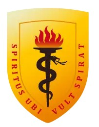
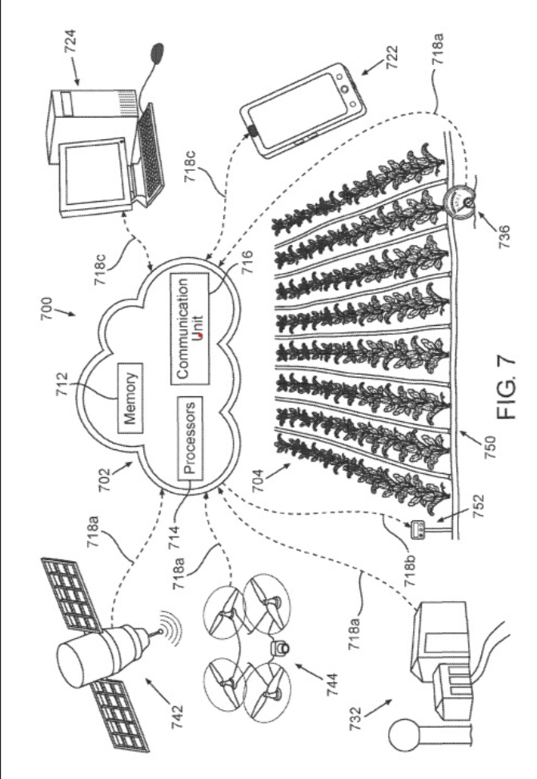
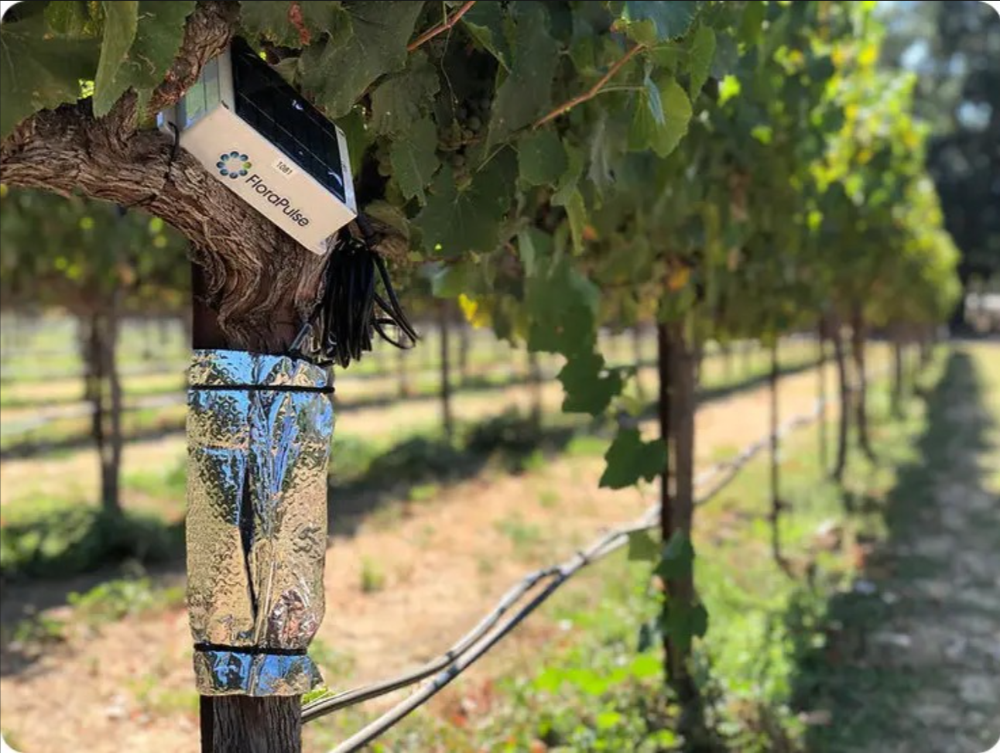
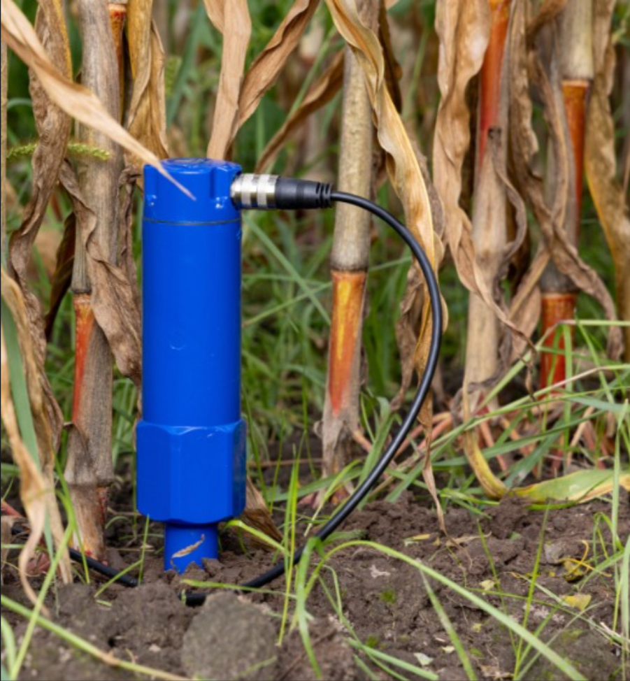

<strong>UNIVERSIDAD PERUANA CAYETANO HEREDIA</strong>

Facultad de Ciencias e Ingeniería

 

  
FUNDAMENTOS DE DISEÑO

TALLER 03
  
REFERENCIAS BIBLIOGRÁFICAS

 

PROFESORES:

 

<em>Marco Antonio Mugaburu Celi</em>

<em>Jose Luiz Da Silva</em>

<em>Jhomer Rodrigo Contreras Paucca</em>
   

PRESENTADO POR:

RAMIREZ URIOL RUBEN MOISES ENMANUEL

PUMA CUTIPA WILL ALEX

CHAVEZ ALIAGA ALDAIR ALEXANDER

ALVAREZ HANAMPA YESSICA

SÁNCHEZ MORÓN ANGELI DARIANA

    
2026

  

***REFERENCIAS BIBLIOGRÁFICAS***

## 1. ARTÍCULOS CIENTÍFICOS.  
     
1. AquaCrop-IoT: plataforma inteligente de riego mediante información del cultivo y condiciones meteorológicas

| RECURSO | TEMA  | APORTE | VARIABLE/CARACTERÍSTICAS | VALORES /RANGOS |
| :---- | :---- | :---- | :---- | :---- |
| Puig et al. (2025) – *AquaCrop-IoT*  | Riego inteligente mediante IoT, visión artificial y pronóstico meteorológico.  | Integra AquaCrop con cámaras RGB y datos climáticos para ajustar el riego según el estado real del cultivo. Logró reducir el agua de riego recomendada en aproximadamente 32 %.  | Cobertura del dosel (CC), temperatura del aire, humedad relativa, precipitación, radiación solar, presión, velocidad/dirección del viento, ET₀ e imágenes RGB.  | Temperatura: 8.4–28.1 °C como promedios mensuales históricos. ET₀: 1.1–7.6 mm/día. Pronóstico: 7 días. Precipitación media: 573 mm/año. Ahorro/reducción: ≈32 %.[(1)](https://www.zotero.org/google-docs/?6KwdvU)  |

2. **Sistemas de riego inteligente habilitados por IoT para la gestión precisa del agua**

| RECURSO | TEMA  | APORTE | VARIABLE/CARACTERÍSTICAS | VALORES /RANGOS |
| :---- | :---- | :---- | :---- | :---- |
| Custódio y Prati (2024)   | Predicción de humedad del suelo mediante IoT y modelos de Machine Learning/series temporales.  | Compara modelos tradicionales y modernos para predecir humedad del suelo. ARIMA obtuvo el mejor resultado en 8 de 10 datasets y los métodos univariados superaron a los avanzados en la mayoría de casos.  | Humedad del suelo, temperatura del suelo, conductividad eléctrica, precipitación, temperatura del aire; modelos ARIMA, Random Forest, XGBoost y StemGNN.  | Datos: 2 años. Profundidades: 0.3, 0.6 y 0.9 m en el dataset principal; otros conjuntos incluyen 0–5, 6–15, 16–30, 31–50 y 51–100 cm. ARIMA: mejor en 8/10 datasets. Ejemplos de MAPE ARIMA: 0.046–0.052 [(2)](https://www.zotero.org/google-docs/?VkoOFp).  |

3.- **Agricultura inteligente mediante IoT para automatización del riego y      eficiencia hídrica y energética**

| RECURSO | TEMA  | APORTE | VARIABLE/CARACTERÍSTICAS | VALORES /RANGOS |
| :---- | :---- | :---- | :---- | :---- |
| Gupta et al. (2025)  | Automatización del riego agrícola mediante IoT y algoritmos predictivos.  | Utiliza sensores conectados a Arduino y datos históricos en tiempo real para predecir necesidades de riego. Redujo aproximadamentun 30 % el consumo de agua.  | Humedad del suelo, temperatura ambiental, humedad relativa, consumo de agua, consumo energético y predicción de necesidad de riego.   | Reducción de agua: ≈30 %. Variación de predicción: \<5 %. Consumo energético promedio: 13.1 W. El artículo consultado no establece rangos experimentales explícitos para temperatura y humedad en su resumen disponible.  [(3)](https://www.zotero.org/google-docs/?aQ15MY)  |

 

## 2. **PATENTES RELACIONADAS CON EL PROYECTO**

| Patente 1 |  |
| :---- | :---- |
| CAMPO | INFORMACIÓN |
| TÍTULO | SISTEMA DE MONITORIZACIÓN DEL CONSUMO DE AGUA PARA EL AHORRO DE ENERGÍA EN INVERNADEROS |
| N° PUBLICACIÓN | CN119739078A |
| CIP | A01G 9/247 |
| TEMA DE LA PATENTE | Sistema inteligente de monitoreo y gestión eficiente del agua en invernaderos agrícolas.  |
| RESUMEN | La patente propone un sistema para controlar el uso del agua en invernaderos mediante varios módulos que monitorean el consumo de agua, la calidad del agua, la distribución del recurso y el funcionamiento de los equipos. Además, utiliza datos históricos y actuales del cultivo y del ambiente para predecir la cantidad de agua necesaria para el riego y ajustar automáticamente el suministro.  |
| APORTES AL PROYECTO | Nos aporta una referencia para desarrollar un sistema de riego más eficiente, porque considera la medición del consumo de agua por zonas, el tipo de cultivo, las condiciones ambientales y el uso de datos históricos para decidir cuánto regar. También permite generar alertas cuando existe falta o exceso de agua, ayudando a reducir desperdicios y mejorar la gestión del recurso hídrico. |
| VARIABLE Y RANGOS/VALORES | Entre las principales variables están la cantidad de agua de riego, temperatura ambiental, precipitación, humedad del suelo, tipo de cultivo, etapa de crecimiento, pH, oxígeno disuelto y conductividad eléctrica. La patente no establece muchos rangos numéricos específicos; principalmente utiliza umbrales previamente definidos para clasificar el consumo de agua como **insuficiente, adecuado o excesivo**, y la calidad del agua como **buena o anormal**. También clasifica las etapas del cultivo en germinación, plántula, crecimiento vegetativo, crecimiento reproductivo y maduración. [(4)](https://www.zotero.org/google-docs/?GepsxK) |

| Patente 2 |  |
| :---- | :---- |
| CAMPO | INFORMACIÓN |
| TÍTULO | METHODS AND SYSTEMS FOR IRRIGATION GUIDANCE |
| N° PUBLICACIÓN | EP3648574B1 |
| CIP | A01G25/16 |
| TEMA DE LA PATENTE | Sistema de riego de precisión para determinar el momento óptimo de riego y la cantidad de agua que necesita un cultivo. |
| RESUMEN | La patente propone un método para gestionar el riego agrícola utilizando información sobre el potencial hídrico de la planta, la evapotranspiración, el coeficiente del cultivo, el estrés hídrico y datos meteorológicos. |
| APORTES AL PROYECTO | Nos aporta una forma más precisa de decidir el riego, ya que no se basa únicamente en horarios fijos, sino en las necesidades reales del cultivo y en las condiciones ambientales. |
| VARIABLES Y RANGOS/VALORES | Las principales variables son la evapotranspiración de referencia ET0, el coeficiente del cultivo Kc, el coeficiente de estrés hídrico Ks, la evapotranspiración real ETa, temperatura, humedad, viento y radiación. |
| IMAGEN REFERENCIAL DE LA PATENTE | 

 <em>Figura. Sistema de riego de precisión descrito en la patente EP3648574B1.</em> |

| Patente 3 |  |
| :---- | :---- |
| CAMPO | INFORMACIÓN  |
| TÍTULO | MÉTODO Y SISTEMA DE PRONÓSTICO DE LA DEMANDA DE AGUA PARA RIEGO DE CULTIVOS A ESCALA DIARIA Y A NIVEL DE PARCELA MEDIANTE TELEDETECCIÓN MULTIFUENTE |
| N° PUBLICACIÓN | CN121303433A |
| CIP | G01W 1/10 |
| TEMA DE LA PATENTE | Pronóstico de la demanda de agua para riego agrícola mediante teledetección. |
| RESUMEN | La patente propone un sistema que integra datos meteorológicos, teledetección, información del tipo y etapa del cultivo y modelos de corrección de pronósticos para calcular diariamente la cantidad de agua que necesita cada parcela. A partir de la evapotranspiración del cultivo y la precipitación efectiva obtiene la necesidad neta de riego. |
| APORTES AL PROYECTO | Nos aporta un método para determinar la cantidad necesaria de agua considerando condiciones meteorológicas y características del cultivo, lo cual permite evitar riegos innecesarios y mejorar la eficiencia en el uso del agua. Además, muestra que se pueden utilizar datos meteorológicos y sensores o teledetección para apoyar la toma de decisiones.  |
| VARIABLES Y RANGOS/VALORES | ET0​ evapotranspiración de referencia, ETcET\_c evapotranspiración del cultivo, precipitación PP, precipitación efectiva PeP\_e, coeficiente de cultivo KcK\_c, radiación neta RnR\_n, temperatura, humedad, velocidad del viento y necesidad neta de riego NIRNIR. La patente menciona, por ejemplo, P≥10 mmP\\geq10\\,mm, 0\<P\<10 mm0\<P\<10\\,mm, coeficiente de aprovechamiento de lluvia entre **0.7 y 0.85**, y ejemplos de Kc=1.1K\_c=1.1 para trigo, 0.40.4 para maíz y 0.80.8 para arroz en determinadas etapas.[(6)](https://www.zotero.org/google-docs/?ez02Ax) |

## 3. **TESIS**

|  | Nombre | Tema | Aporte | Variables |
| :---- | :---- | :---- | :---- | :---- |
| 1 | Aplicación de riego deficitario de secado parcial de la zona de raíces en el cultivo de durazno mediante el riego por goteo | Implementación de una técnica de riego para disminuir los aportes hídricos con respecto a las necesidades de riego del cultivo del durazno. | El efecto de la aplicación del Riego Deficitario de Secado Parcial en la Zona de Raíces (SPZR) mediante el rendimiento de la producción y se determinó el volumen de agua utilizado en los cultivos. | Se aplicaron dos tratamientos de riego en 28 árboles o unidades experimentales de las variedades Canario y Florida 39\. 1\. Riego Deficitario de Secado Parcial en la Zona de Raíces (SPZR). 2\. El tratamiento de riego control.[(7)](https://www.zotero.org/google-docs/?jmaken) |
| 2 | Sistema de riego automatizado para solanum lycopersicum con IoT y modelos predictivos para el ahorro de agua en entornos urbanos | Optimización del uso del agua en la agricultura urbana de Lima Metropolitana. | Se desarrolla un sistema automatizado para la irrigación inteligente de cultivos de tomate (Solanum lycopersicum var. cerasiforme) basado en el Internet de las Cosas (IoT) y algoritmos de predicción. | Se emplean sensores para la medición de la humedad del suelo y la temperatura del ambiente. Los valores utilizados son; hora, humedad, temperatura, agua perdida, agua a regar.[(8)](https://www.zotero.org/google-docs/?zEPLgX) |
| 3 | Diseño de un sistema de Iot para optimizar el riego de la agricultura en el distrito de Viñas | Diseñar un sistema de Internet de las Cosas para optimizar la gestión de riego en la agricultura del Anexo de Viñas 2024, donde se enfrenta una problemática significativa de escasez de agua y prácticas de riego ineficientes. | Se desarrolló un prototipo de sistema basado en un microcontrolador ESP32 que integra sensores de flujo, sensores ultrasónicos, válvulas solenoides y conectividad Wi-Fi, controlados mediante una plataforma web. | Incluye el despliegue de una red de sensores y actuadores conectados a Internet que recolectan datos del entorno agrícola y los envían a una plataforma centralizada para su análisis y toma de decisiones. Las dimensiones que se emplearon fueron; precisión del agua entregada (volumen), tiempo de respuesta (segundos).[(9)](https://www.zotero.org/google-docs/?GGonjK) |

## 4. **APLICACIONES COMERCIALES.**

|  | Producto 1 |
| :---- | :---- |
| Nombre | *Strato (CropX)*  |
| Descripción general. | Estación meteorológica "todo en uno" de alta precisión diseñada para agricultura, preensamblada con sensores, alimentación solar y conectividad celular. Entrega datos hiperlocales en tiempo real e integra sus lecturas a la plataforma digital CropX para alimentar modelos agronómicos de riego y enfermedades.  |
| Aporte | **Telemetría y Adquisición Hiperlocal:** La estación Strato 1 integra de forma compacta sensores de alta precisión para medir temperatura, humedad, viento y precipitaciones en tiempo real, transmitiendo vía celular. Esto demuestra la viabilidad técnica de consolidar múltiples variables meteorológicas en un solo nodo de campo de bajo consumo para alimentar modelos en la nube. **Integración con Modelos Agronómicos:** Los datos recolectados por el dispositivo alimentan directamente los algoritmos adaptativos de riego y prevención de enfermedades de CropX. Esto sirve como referencia para justificar que las lecturas ambientales de su prototipo no solo muestren datos aislados, sino que reajusten automáticamente las constantes del algoritmo de riego según la evapotranspiración y la variabilidad climática local. |
| Variables | Temperatura del aire, humedad relativa, velocidad del viento, dirección del viento, precipitación/lluvia y radiación solar.  |
| Detalles técnicos | Rango/Precisión Temp.: \-40° a 185°F (±0.36°F). Rango/Precisión Humedad: 0% a 100% (±1.8%). Velocidad Viento: 0.5 a 45 m/s (±0.1 m/s). Pluviómetro: 0.2 mm por balancín (precisión ±2%). Conectividad: Dispositivo de telemetría CropX con conexión celular. Alimentación: Batería recargable/reemplazable de Li-Ion con panel solar integrado. Intervalos: Medición cada 5-15 min; envío cada 15-60 min (configurables). |
| Imagen referencial del producto | 

   **Figura 1\.** Sensor Strato de CropX para el monitoreo de las condiciones del suelo. **Fuente:** CropX Technologies (2026).*  |
| Referencia bibliográfica | CropX Inc. Estación meteorológica todo en uno: Strato 1 \[Ficha técnica en línea\]. Tel Aviv: CropX; 2024 \[citado el 3 de septiembre de 2026\]. [(10)](https://www.zotero.org/google-docs/?QzJarc) Disponible en: [https://cropx.com/cropx-system/hardware/](https://cropx.com/cropx-system/hardware/)  |

|  | Producto 2 | 
| :---- | :---- |
| Nombre | *FloraPulse – Sensor de potencial hídrico del tallo*  |
| Descripción general. | Sistema de monitoreo agrícola que utiliza un microtensiómetro insertado en el tallo para medir directamente el potencial hídrico (SWP) de árboles y vides. Permite registrar continuamente el estado hídrico de la planta y transmitir los datos a una plataforma digital para su análisis.  |
| Aporte | Sirve como referente para desarrollar un sistema de riego inteligente basado en el estado fisiológico de la planta. Permite detectar estrés hídrico y utilizar esta información como criterio para optimizar la frecuencia y cantidad de riego, integrando sensado, procesamiento de datos y automatización.  |
| Variables/ rango/  | **Variable:** potencial hídrico del tallo (SWP).  **Rango:** 0 a −35 bar (0 a −3,5 MPa).  **Resolución:** 0,1 bar.  **Precisión:** ±5 %.  **Medición:** cada 20 min.  **Temperatura:** 5–50 °C.  |
| Detalles técnicos | Microtensiómetro con membrana de silicio nanoporoso, instalación directa en el tejido vegetal, alimentación mediante panel solar y batería de litio y transmisión inalámbrica de datos mediante conexión celular.  |
| Imagen referencial del producto | 

   ***Figura 2**. Microtensiómetro FloraPulse instalado en el tronco para monitoreo continuo del potencial hídrico. **Fuente:** FloraPulse (2026). [(11)](https://www.zotero.org/google-docs/?nctISj)* |
| Referencia bibliografica | FloraPulse. How FloraPulse works: microtensiometer technology explained \[Internet\]. FloraPulse; 2026 \[citado 2026 Sep 3\]. Disponible en: [Sensores de riego de origen vegetal para huertos y viñedos \- FloraPulse](https://florapulse.com/)  |

|  | Producto 3 CropX |
| :---- | :---- |
| Nombre | *CropX – Sensor de suelo y sistema de telemetría*  |
| Descripción general. | Sistema de monitoreo agrícola que utiliza sensores instalados en el suelo para obtener datos de la zona radicular en tiempo real. El sensor mide variables como contenido volumétrico de agua (VWC), temperatura y conductividad eléctrica (EC), permitiendo analizar la disponibilidad de agua y las condiciones del suelo que afectan al cultivo. Los datos son enviados a la plataforma CropX para su visualización y análisis agronómico.  |
| Aporte | Permite establecer un sistema de monitoreo de las condiciones del suelo que puede utilizarse como entrada para la gestión automatizada del riego. Los datos de humedad en la zona radicular permiten determinar cuándo el suelo requiere reposición de agua, mientras que la temperatura y conductividad eléctrica aportan información complementaria sobre las condiciones del cultivo. Esto sirve como referencia para integrar sensores, telemetría y toma de decisiones basada en datos.  |
| Variables/ Rangos/ valores | **Humedad (VWC):** 0–60 %, precisión ±0,5 %.  **Temperatura:** −10 a 70 °C, precisión hasta ±0,5 °C.  **Conductividad eléctrica (EC):** 0–5 dS/m.  **Profundidad:** mediciones configurables en diferentes niveles del perfil del suelo.  |
| Detalles técnicos | Sensor de suelo con diseño espiral patentado, sensores integrados para humedad, temperatura y EC, autocalibración, batería extraíble y recargable, antena desmontable y telemetría integrada. El diseño permite realizar mediciones a diferentes profundidades y transmitir los datos a la plataforma CropX.  |
| Imagen referencial del producto | 
 
  **Figura 3\.** Sensor de suelo CropX Vertex para monitoreo de las condiciones de la zona radicular. **Fuente:** CropX Technologies (2026). [(12)](https://www.zotero.org/google-docs/?3pg4q1) |
| Número de  Referencia. | CropX Technologies. CropX Hardware: soil sensor and telemetry \[Internet\]. CropX; 2026 \[citado 2026 Sep 3\]. Disponible en: [Sistema de Gestión Agronómica de Granjas CropX](https://cropx.com/)  |

 

## **REFERENCIAS BIBLIOGRÁFICAS:** 

[1\.](https://www.zotero.org/google-docs/?nUIc5F)	[Puig F, Garcia-Vila M, Soriano MA, Rodríguez-Díaz JA. AquaCrop-IoT: A smart irrigation platform integrating real-time images and weather forecasting. Comput Electron Agric. 1 de agosto de 2025;235:110372. doi:10.1016/j.compag.2025.110372](https://www.zotero.org/google-docs/?nUIc5F) 

[2\.](https://www.zotero.org/google-docs/?nUIc5F)	[Custódio G, Prati RC. Comparing modern and traditional modeling methods for predicting soil moisture in IoT-based irrigation systems. Smart Agric Technol. 1 de marzo de 2024;7:100397. doi:10.1016/j.atech.2024.100397](https://www.zotero.org/google-docs/?nUIc5F) 

[3\.](https://www.zotero.org/google-docs/?nUIc5F)	[Gupta S, Chowdhury S, Govindaraj R, Amesho KTT, Shangdiar S, Kadhila T, et al. Smart agriculture using IoT for automated irrigation, water and energy efficiency. Smart Agric Technol. 1 de diciembre de 2025;12:101081. doi:10.1016/j.atech.2025.101081](https://www.zotero.org/google-docs/?nUIc5F) 

[4\.](https://www.zotero.org/google-docs/?nUIc5F)	[CN119739078A \- A greenhouse energy-saving water use monitoring system \- Google Patents \[Internet\]. \[citado 3 de septiembre de 2026\]. Disponible en: https://patents.google.com/patent/CN119739078A/en](https://www.zotero.org/google-docs/?nUIc5F) 

[5\.](https://www.zotero.org/google-docs/?nUIc5F)	[EP3648574B1 \- Methods and systems for irrigation guidance \- Google Patents \[Internet\]. \[citado 3 de septiembre de 2026\]. Disponible en: https://patents.google.com/patent/EP3648574B1/en?oq=EP3648574B1](https://www.zotero.org/google-docs/?nUIc5F) 

[6\.](https://www.zotero.org/google-docs/?nUIc5F)	[Sun S, Wu Y, Li C, Ge M, Cao H, Chen J, et al. Multi-source remote sensing daily-scale plot-level crop irrigation water demand forecasting method and system. CN121303433A, 2026\.](https://www.zotero.org/google-docs/?nUIc5F) 

[7\.](https://www.zotero.org/google-docs/?nUIc5F)	[Atoccsa Gomez RB. Aplicación de riego deficitario de secado parcial de la zona de raíces en el cultivo de durazno mediante el riego por goteo \[Internet\]. 2015 \[citado 3 de septiembre de 2026\]. Disponible en: https://hdl.handle.net/20.500.12996/924](https://www.zotero.org/google-docs/?nUIc5F) 

[8\.](https://www.zotero.org/google-docs/?nUIc5F)	[Anci Yep JA. Sistema de riego automatizado para solanum lycopersicum con IoT y modelos predictivos para el ahorro de agua en entornos urbanos. 2025\.](https://www.zotero.org/google-docs/?nUIc5F) 

[9\.](https://www.zotero.org/google-docs/?nUIc5F)	[Lavado Tisza K, Moran Retamozo GL. Diseño de un sistema de Iot para optimizar el riego de la agricultura en el distrito de Viñas \[Internet\]. 23 de diciembre de 2025 \[citado 3 de septiembre de 2026\]. Disponible en: https://hdl.handle.net/20.500.14597/26882](https://www.zotero.org/google-docs/?nUIc5F) 

[10\.](https://www.zotero.org/google-docs/?nUIc5F)	[CropX Hardware. CropX Digital Agronomy Platform and Farm Management System \[Internet\]. \[citado 3 de septiembre de 2026\]. Disponible en: https://cropx.com/cropx-system/hardware/](https://www.zotero.org/google-docs/?nUIc5F) 

[11\.](https://www.zotero.org/google-docs/?nUIc5F)	[Plant-Based Irrigation Sensors for Orchards & Vineyards \- FloraPulse \[Internet\]. \[citado 3 de septiembre de 2026\]. Disponible en: https://florapulse.com/](https://www.zotero.org/google-docs/?nUIc5F) 

[12\.](https://www.zotero.org/google-docs/?nUIc5F)	[CropX Digital Agronomy Platform and Farm Management System \[Internet\]. \[citado 3 de septiembre de 2026\]. Home. Disponible en: https://cropx.com/](https://www.zotero.org/google-docs/?nUIc5F) 

