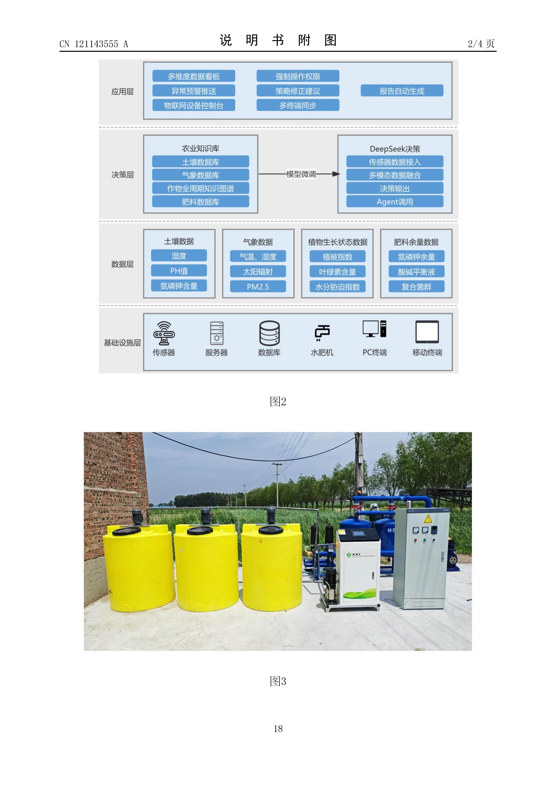
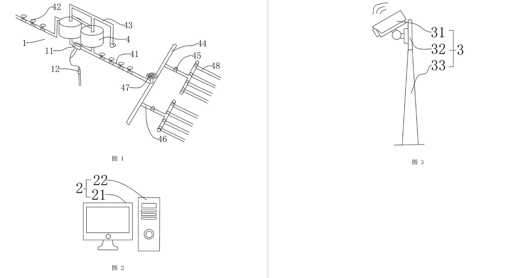

<strong>UNIVERSIDAD PERUANA CAYETANO HEREDIA</strong>

Facultad de Ciencias e Ingeniería

 

  
FUNDAMENTOS DE DISEÑO

TALLER 03
  
REFERENCIAS BIBLIOGRÁFICAS

 

PROFESORES:

 

<em>Marco Antonio Mugaburu Celi</em>

<em>Jose Luiz Da Silva</em>

<em>Jhomer Rodrigo Contreras Paucca</em>
   

PRESENTADO POR:

RAMIREZ URIOL RUBEN MOISES ENMANUEL

PUMA CUTIPA WILL ALEX

CHAVEZ ALIAGA ALDAIR ALEXANDER

ALVAREZ HANAMPA YESSICA

SÁNCHEZ MORÓN ANGELI DARIANA

    
2026

  

***REVISION DE PATENTES***  
**Patente 1:**

| Título de la invención | Sistema inteligente de riego integrado de agua y fertilizantes basado en sensores de Internet de las Cosas y un modelo de lenguaje extenso |
| :---- | :---- |
| Número de publicación | CN121143555A |
| Fecha de publicación | 16/12/2025 |
| Breve resumen | El sistema utiliza sensores de Internet de las Cosas (suelo, meteorológicos y multiespectrales) y un modelo de lenguaje a gran escala para analizar en tiempo real las necesidades de los cultivos y generar estrategias de riego precisas. Esto permite ajustar automáticamente la cantidad de agua aplicada mediante un control en bucle cerrado, logrando mejorar la tasa de utilización del agua en un 30 % o más. |
| Campo de aplicación | Agricultura inteligente y gestión de recursos hídricos y nutricionales en terrenos agrícolas. |
| Imagen de la patente | 

   |

**Patente 2:**

| Título de la invención | Sistema automático de riego y fumigación de pesticidas para tierras de cultivo, provisto además de tratamiento mediante inteligencia artificial.  |
| :---- | :---- |
| Número de publicación | CN214902773U  |
| Fecha de publicación | 30/11/2021  |
| Breve resumen | Este modelo de utilidad propone un sistema automático de riego y fumigación agrícola con inteligencia artificial, capaz de monitorear las propiedades del suelo mediante sensores y transmitir los datos a una unidad inteligente de procesamiento. A partir de esta información, el sistema puede controlar automáticamente el riego y la aplicación de pesticidas, permitiendo conocer las condiciones fisicoquímicas del suelo y adaptar las operaciones agrícolas a distintos terrenos y ambientes. |
| Campo de aplicación | Producción agrícola, en particular con un sistema automático de riego y fumigación de pesticidas para tierras de cultivo equipado con procesamiento mediante inteligencia artificial.  |
| Imagen de la patente | 

   |

**Patente 3:**

| Título de la invención | Sistema de riego inteligente agrícola basado en inteligencia artificial y big data  |
| :---- | :---- |
| Número de publicación | CN113575388A  |
| Fecha de publicación | 2021-11-02  |
| Breve resumen | Integra análisis de imágenes RGB del cultivo para evaluar su estado de crecimiento (color y textura), combinado con sensores de humedad en tiempo real. Un módulo de IA predice el consumo hídrico óptimo y el grado de sequía para regar zonas áridas de manera focalizada, evitando el desperdicio de agua.  |
| Campo de aplicación | Agricultura de precisión, riego inteligente adaptativo y gestión de recursos hídricos mediante inteligencia artificial en zonas de sequía o de clima árido.  |
| Imagen de la patente | 

   |

