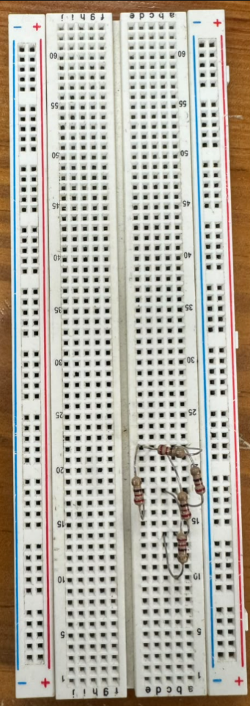
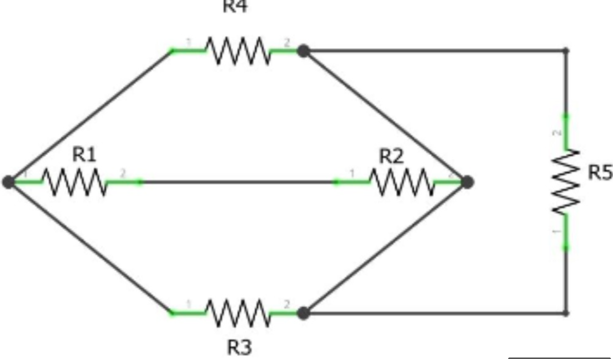
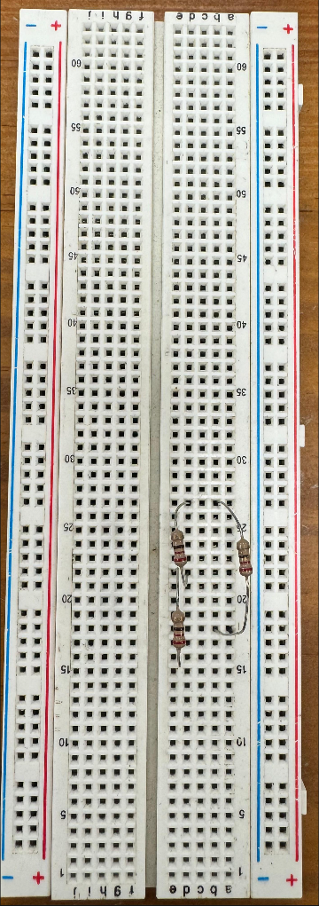
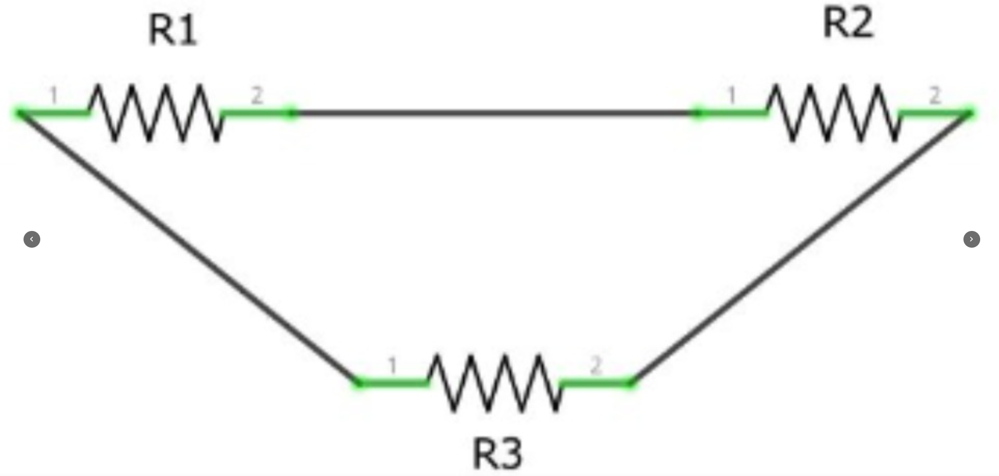
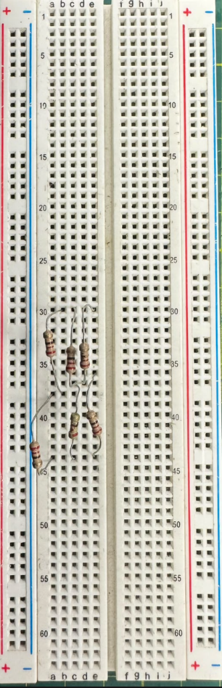
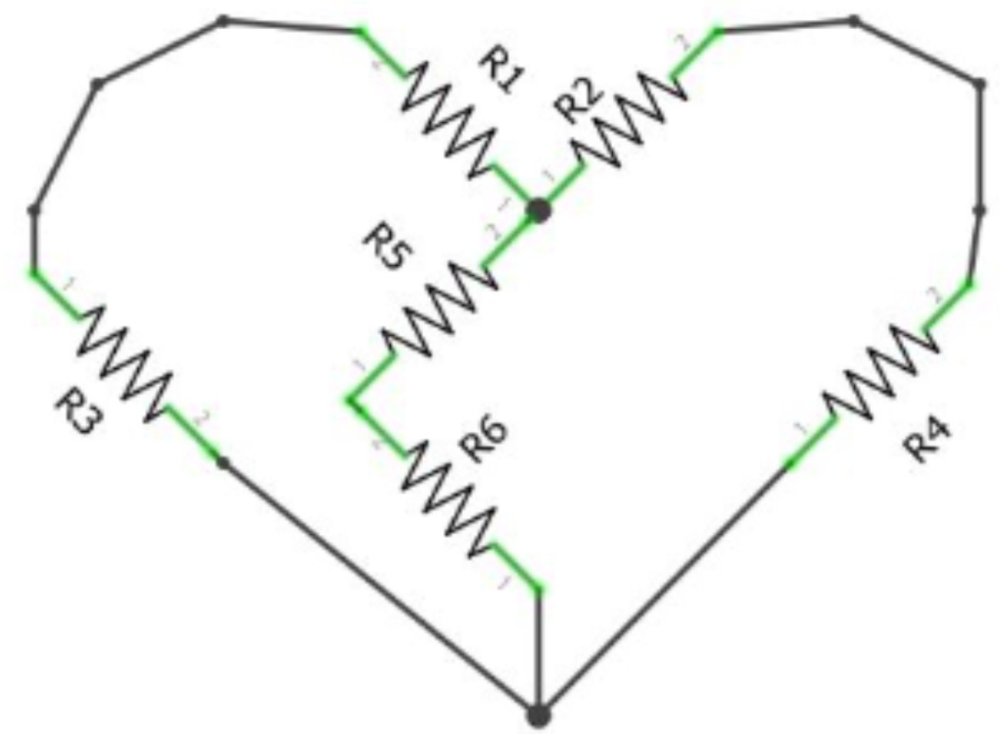

<strong>UNIVERSIDAD PERUANA CAYETANO HEREDIA</strong>

Facultad de Ciencias e Ingeniería

 

  
FUNDAMENTOS DE DISEÑO

TALLER 05
  
CIRCUITOS ELECTRONICOS

 

PROFESORES:

 

<em>Marco Antonio Mugaburu Celi</em>

<em>Jose Luiz Da Silva</em>

<em>Jhomer Rodrigo Contreras Paucca</em>
   

PRESENTADO POR:

RAMIREZ URIOL RUBEN MOISES ENMANUEL

PUMA CUTIPA WILL ALEX

CHAVEZ ALIAGA ALDAIR ALEXANDER

ALVAREZ HANAMPA YESSICA

SÁNCHEZ MORÓN ANGELI DARIANA

    
2026

  

|  | Protoboard | Circuito | Resistencia equivalente |
| :---- | :---- | :---- | :---- |
| 1 | 

  |

  | **Medición Ideal:** 88,0 Ω  **Medición real:** 86,1 Ω |
| 2 | 

  |

   | **Medición Ideal:** 146,6 Ω **Medición real:** 143,2 Ω |
| 3 |

  |

   | **Medición Ideal:** 146, 6 Ω  **Medición real:** 144,2 Ω  |

| MEDICIONES | 5V | 3,3V | 12V |
| :---- | :---- | :---- | :---- |
| 1 | 5,035 | 3,372 | 12,11 |
| 2 | 5,044 | 3,318 | 12,14 |
| 3 | 5,033 | 3,324 | 12,07 |
| 4 | 5,032 | 3,338 | 12,11 |
| 5 | 5,048 | 3,346 | 12,12 |
| 6 | 5,019 | 3,364 | 12,10 |
| 7 | 5,070 | 3,353 | 12,15 |
| 8 | 5,058 | 3,355 | 12,10 |
| 9 | 5,030 | 3,364 | 12,09 |
| 10 | 5,104 | 3,359 | 12,12 |
| promedios | 5,0473 | 3,3493 | 12,111 |

**Mediciones de voltajes:**

TABLA DE ERRORES:  
5 V:

|  | 1 | 2 | 3 | 4 | 5 | 6 | 7 | 8 | 9 | 10 |
| :---- | :---- | :---- | :---- | :---- | :---- | :---- | :---- | :---- | :---- | :---- |
| E. A. | 0.035 | 0.044 | 0.032 | 0.048 | 0.048 | 0.019 | 0.07 | 0.058 | 0.03 | 0.104 |
| E. R. (%) | 0.7 | 0.88 | 0.64 | 0.96 | 0.96 | 0.38 | 1.4 | 1.16 | 0.6 | 2.08 |

3.3 V:

|  | 1 | 2 | 3 | 4 | 5 | 6 | 7 | 8 | 9 | 10 |
| :---- | :---- | :---- | :---- | :---- | :---- | :---- | :---- | :---- | :---- | :---- |
| E. A. | 0.072 | 0.018 | 0.024 | 0.038 | 0.046 | 0.064 | 0.053 | 0.055 | 0.064 | 0.059 |
| E. R. (%) | 2.18 | 0.54 | 0.72 | 1.15 | 1.39 | 1.93 | 1.60 | 1.66 | 1.93 | 1.78 |

12 V:

|  | 1 | 2 | 3 | 4 | 5 | 6 | 7 | 8 | 9 | 10 |
| :---- | :---- | :---- | :---- | :---- | :---- | :---- | :---- | :---- | :---- | :---- |
| E. A. | 0.11 | 0.14 | 0.07 | 0.11 | 0.12 | 0.10 | 0.15 | 0.10 | 0.09 | 0.12 |
| E. R. (%) | 0.916 | 1.16 | 0.583 | 0.916 | 1 | 0.83 | 1.25 | 0.83 | 0.75 | 1 |

