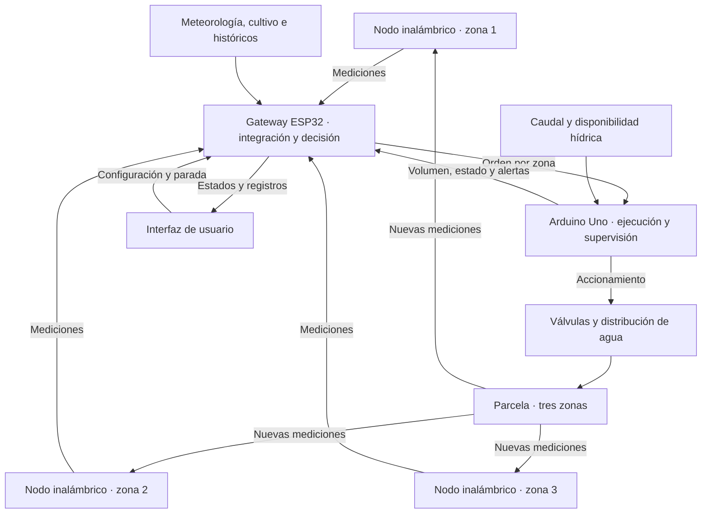

#  HydroAdapt Equipo 13
**Sistema adaptativo de gestión hídrica para riego de precisión**
# Fundamentos de Diseño
### Carrera de Ingeniería Ambiental / Informática / Industrial  
**Universidad Peruana Cayetano Heredia**

---
HydroAdapt es una propuesta de prototipo experimental para gestionar el riego de una parcela de lechuga de **24 m²**, dividida en **tres zonas de 8 m²**, en el contexto del valle Chancay-Huaral. Integra mediciones de la parcela, información del cultivo, datos meteorológicos e históricos de operación para determinar cuándo y cuánto regar por zona y verificar el suministro de agua.
## 🌍 Descripción del Equipo 
Somos el **Equipo 13** del curso **Fundamentos de Diseño**, conformado por estudiantes de la carrera de Ingeniería Ambiental / Informática / Industrial.  
Nuestro objetivo es aplicar la metodología de diseño para generar soluciones innovadoras con impacto social, tecnológico y ambiental.  

## Objetivos de Desarrollo Sostenible

- **ODS 6 — Agua limpia y saneamiento:** eje principal, asociado al uso eficiente del agua.
- **ODS 12 — Producción y consumo responsables:** uso responsable de recursos y selección de componentes.
- **ODS 13 — Acción por el clima:** consideración de las condiciones ambientales en las decisiones de riego.

---
## Problema y objetivo

El proyecto aborda la dificultad de determinar y verificar el riego por zona cuando las decisiones no integran las condiciones del suelo, el ambiente y la etapa de desarrollo del cultivo. La magnitud de esta dificultad en la parcela seleccionada deberá establecerse mediante un diagnóstico inicial.

**Objetivo:** diseñar y evaluar un sistema que transforme información local y de contexto en decisiones diferenciadas de riego, ejecute las órdenes y registre el agua aplicada y la respuesta posterior del suelo.

## Alcance del prototipo

| Aspecto | Alcance propuesto |
|---|---|
| Cultivo y superficie | Lechuga (*Lactuca sativa* L.) en una parcela de 6 × 4 m. |
| Zonificación | Tres zonas de 8 m² con un nodo inalámbrico de monitoreo por zona. |
| Mediciones | Humedad del suelo por zona; temperatura y humedad relativa del aire como complemento. La distribución de sensores ambientales está pendiente de selección. |
| Supervisión del suministro | Medición de caudal, cálculo del volumen aplicado y comprobación de disponibilidad de agua. |
| Contexto | Información del cultivo, registros históricos y datos meteorológicos pertinentes de SENAMHI. |
| Procesamiento y decisión | Gateway ESP32 con inferencia local de un modelo previamente entrenado. |
| Actuación | Arduino Uno encargado de ejecutar las órdenes y supervisar el riego. |
| Operación | Ciclo básico sin computadora ni conexión permanente a Internet. El entrenamiento se realiza fuera del dispositivo. |
| Presupuesto objetivo | S/250–350 para materiales; viabilidad pendiente de una lista de componentes cotizada. |

La visión artificial, el análisis multiespectral y la aplicación automatizada de fertilizantes o pesticidas quedan fuera del alcance inicial.
## Arquitectura propuesta

El microcontrolador de los nodos, la radio, la alimentación y los modelos de sensores se seleccionarán comparando alternativas compatibles. ESP32 y Arduino Uno tienen funciones diferenciadas: el gateway determina la acción y el controlador valida y ejecuta la orden dentro de los límites configurados.

Si se utiliza un caudalímetro común, las zonas se regarán secuencialmente para asociar el volumen medido con la zona activa. La retroalimentación incorpora registros para evaluar futuras decisiones; no implica reentrenar automáticamente el modelo durante la operación.
## Diseño funcional y selección de soluciones

El análisis se organiza en **once funciones principales, F1–F11**, desde la adquisición de información hasta la verificación del riego y la comunicación al usuario. Su realización se estudia en cinco dominios: electrónico, mecánico, energético, control y software.

La entrega 2 vincula la lista de exigencias, la caja negra, las secuencias de operación y la estructura funcional con las matrices morfológicas. Las alternativas se combinarán en **tres conceptos de solución**, representados mediante bocetos y comparados con una **matriz de Pugh**. La selección del concepto final aún está pendiente.

## 📸 Fotografía del Equipo  

  <em>Fotografía del equipo 13</em>

---

## 👥 Integrantes del Equipo  

| Foto | Nombre | Rol | Intereses |
|------|--------|-----|-----------|
|  | Ruben Moises Enmanuel Ramirez Uriol | Líder del equipo | Innovación social, sostenibilidad |
|  | Aldair Alexander Chavez Aliaga | Responsable de investigación | Gestión ambiental, desarrollo comunitario |
|  | Angeli Dariana Sanchez Moron | Diseñador/a | Diseño de prototipos, creatividad aplicada |
|  | Will Alex Puma Cutipa | Encargado/a de documentación | Comunicación científica, redacción técnica |
|  | Yessica Alvarez Hanampa | Programador/a - Modelador/a | Programación, análisis de datos, simulación |

---

## 📌 Resumen Final  
HydroAdapt es un proyecto del Equipo 13 de Fundamentos de Diseño de la UPCH que propone un sistema adaptativo de riego para una parcela experimental de lechuga de 24 m² en Chancay-Huaral, dividida en tres zonas. Su arquitectura contempla tres nodos inalámbricos de monitoreo, un gateway ESP32 que utilizará aprendizaje automático para apoyar las decisiones de riego y un Arduino Uno encargado de ejecutar y supervisar el suministro de agua. El diseño integra once funciones y cinco dominios: electrónico, mecánico, energético, control y software. Actualmente, se ha realizado una prueba de medición en tierra seca y húmeda con transmisión de datos por Bluetooth; la integración del modelo y del sistema hidráulico corresponde a las siguientes etapas. El repositorio reúne la documentación técnica, las alternativas de solución, los entregables y las evidencias del desarrollo.